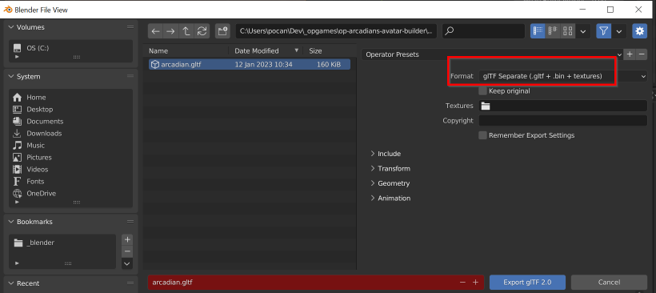

# arcadians-avatar-builder 🧙

## What's this?

This project will be embedded to the Arcadians v2 mint site. It shows an animated Arcadian and can play different animations and wear different parts

## Features:

-   This takes in a GLTF file that contains the mesh of an animated Arcadian.
-   The parts of the Arcadian can be mixed and matched
-   Predefined animations can be exported to a PNG sprite sheet
-   Front end HTML code can call the functions in the JS code to change parts and animations

## Getting started

-   Clone the repository
-   Run any http server on the working directory (i.e. `http-server`)
-   Open http://localhost:8080

## Config file

-   [`config.js`](src/config.js) has been provided as a starting point that contains the v1 Arcadians data
-   It contains settings on the following:
    -   exporting the sprite sheet
    -   list of gltf files, materials and animations
    -   list of parts
-   The config file contains documentation comments on the important sections

## Adding new pngs to existing parts

New pngs can be added in the selection by copying the pngs to their appropriate folder in ['v1/arcadian-parts'](v1/arcadian-parts).

Directories here as structured as:

`arcadian-parts/[Gender]/[Part]/[FileName].png`

Take care to keep the directory structure as is.

Once all the desired pngs have been added, run ['updatePartsConfig.js'](src/updatePartsConfig.js) via node in the terminal. E.g. if you have the terminal open in the root directory, the command would be:

To run for V1 - `node src/updatePartsConfig.js`
To run for V2 - `node src/updatePartsConfig.js v2`

If no errors pop up, then the config has been updated and the new parts can be viewed in the html on refresh.

## Adding new body parts

For each body part, you will have to do the following steps:

1. Add the body part pngs
	1. Create a new directory for the new part, like so: `v2/arcadian-parts/<Gender>/<Body Part Name>/`
	1. Place the PNGs there
	1. Run parts config script. `node src/updatePartsConfig.js v2`
1. Update the Blender file by adding new polygons that would be used for that new part
	1. [Duplicate an existing material](docs/dup-material.md)
	1. Assign faces that would use this new material
	1. Export to GLTF  
	
1. Update src/config-v2.js to add the new material name
1. After these steps, the new body part should be usable

## Avatar Canvas Game Lego

-   [`avatarCanvas.js`](src/avatarCanvas.js) is a reusable game lego for drawing and playing animations from the exported sprite sheet
-   [Demo page](test-avatar-canvas.html) has been provided as a sample how to use this class
